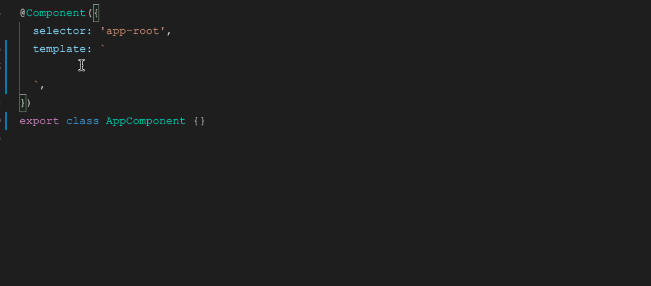

# ng-alain 的 vscode 代码片断

请至[Issuses](https://github.com/cipchk/ng-alain-vscode/issues)提交可能遇到的问题或期望增加的代码片断。

为了更好的使用 ng-alain 工具 CSS 类样式，`3.x` 开始内置同 [IntelliSense for CSS class names in HTML](https://marketplace.visualstudio.com/items?itemName=Zignd.html-css-class-completion) 相似的功能，若已安装该插件可以在开发 ng-alain 时禁用该插件。

[英文](README.md)

## 语言版本

- [English Version](https://marketplace.visualstudio.com/items?itemName=cipchk.ng-alain-vscode)
- [中文版本](https://marketplace.visualstudio.com/items?itemName=cipchk.ng-alain-vscode-zh-CN)

## 链接

- [issues](https://github.com/cipchk/ng-alain-vscode/issues)
- [Marketplace](https://marketplace.visualstudio.com/items?itemName=cipchk.ng-alain-vscode)

## 如何使用?

你可以任意 `.html` 文件，输入 `na-` 开头会自动出现在智能提醒列表当中；仅此而已！

> 建议开启 `"editor.snippetSuggestions": "top"` 配置，可确保代码片断优先级高于内置。

## 更新日志

见[CHANGELOG.md](CHANGELOG.md)
